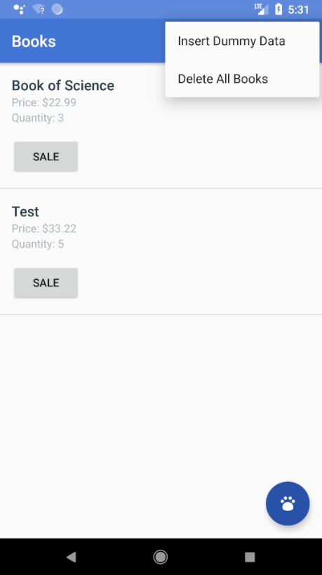
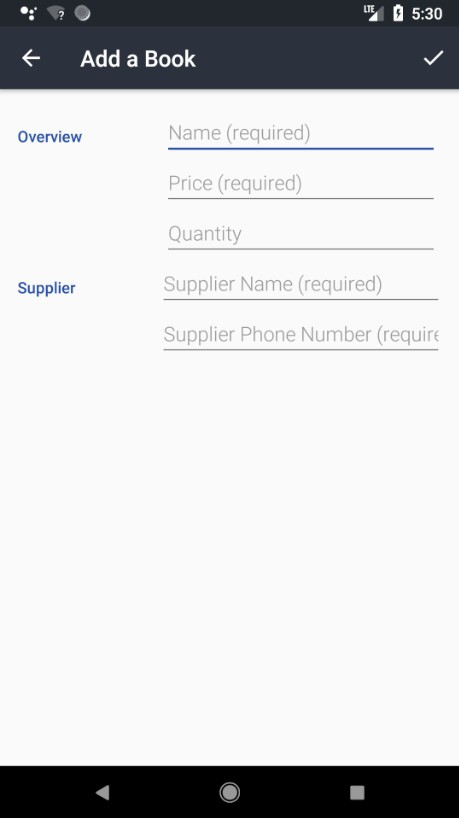

# Inventory App Stage 2

Project #9 for Android Basics by Google Nanodegree Program

<h3>Layout</h3>
<table>
  <tr>
    <th>Criteria</th>
    <th>Meets Specifications</th>
  </tr>
  <tbody>
    <tr>
      <td>
        
Overall Layout

      </td>
      <td>
        
The app contains activities and/or fragments for the user to:

        <ul>
          <li>Add Inventory</li>
          <li>See Product Details</li>
          <li>Edit Product Details</li>
          <li>See a list of all inventory from a Main Activity</li>
        </ul>
        
Multiple actions listed above can be combined in a single activity. 
        The user navigates between the activities and/or fragments using one or more of the following navigation patterns - Navigation Drawer, View Pager, Up/Back Navigation, or Intents.

      </td>
    </tr>
    <tr>
      <td>
        
List Item Layout in the Main Activity

      </td>
      <td>
        
In the Main Activity/Fragment, each list item displays the Product Name, Price, and Quantity.

        
Each list item also contains a SaleButton that reduces the total quantity of that particular product by one (include logic so that no negative quantities are displayed).

      </td>
    </tr>
    <tr>
      <td>
        
Product Detail Layout

      </td>
      <td>
        
The Product Detail Layout displays the Product Name, Price, Quantity, Supplier Name, and Supplier Phone Number that's stored in the database.

        
The Product Detail Layout also contains buttons that increase and decrease the available quantity displayed.

        
Add a check in the code to ensure that no negative quantities display (zero is the lowest amount).

        
The Product Detail Layout contains a button to delete the product record entirely.

        
The Product Detail Layout contains a button to order from the supplier. In other words, there exists a button to contains a button for the user to contact the supplier via an intent to a phone app using the Supplier Phone Number stored in the database.

        
Note: Including the Product Image is an optional feature. The functionality to pick a picture from the gallery is beyond the scope of this program, but students who are interested in learning this functionality may implement it.

      </td>
    </tr>
    <tr>
      <td>
        
Default Textview

      </td>
      <td>
        
When there is no information to display in the database, the layout displays a TextView with instructions on how to populate the database (e.g. what should be entered in the field, which fields are required).

      </td>
    </tr>
    <tr>
      <td>
        
Layout Best Practices

      </td>
      <td>
        
The code adheres to all of the following best practices:

        <ul>
          <li>Text sizes are defined in sp</li>
          <li>Lengths are defined in dp</li>
          <li>Padding and margin is used appropriately, such that the views are not crammed up against each other.</li>
        </ul>
      </td>
    </tr>
  </tbody>
</table>

<h3>Functionality</h3>
<table>
  <tr>
    <th>Criteria</th>
    <th>Meets Specifications</th>
  </tr>
  <tbody>
    <tr>
      <td>
        
Runtime Errors

      </td>
      <td>
        
The code runs without errors. For example, when user inputs product information (quantity, price, name), instead of erroring out, the app includes logic to validate that no null values are accepted. If a null value is inputted, add a Toast that prompts the user to input the correct information before they can continue.

      </td>
    </tr>
    <tr>
      <td>
        
ListView Population

      </td>
      <td>
        
The Main Activity displaying the list of current inventory contains a ListView that populates with the current products stored in the table.

      </td>
    </tr>
    <tr>
      <td>
        
Add Product Button

      </td>
      <td>
        
The Main Activity contains an Add Product Button prompts the user for product information and supplier information which are then properly stored in the table.

        
Before the information is added to the table, it must be validated - 
        In particular, empty product information is not accepted. If user inputs invalid product information (name, price, quantity, supplier name, supplier phone number), instead of erroring out, the app includes logic to validate that no null values are accepted. If a null value is inputted, add a Toast that prompts the user to input the correct information before they can continue.

      </td>
    </tr>
    <tr>
      <td>
        
Input Validation

      </td>
      <td>
        
In the Edit Product Activity, user input is validated. In particular, empty product information is not accepted. If user inputs invalid product information (name, price, quantity, supplier name, supplier phone number), instead of erroring out, the app includes logic to validate that no null values are accepted. If a null value is inputted, add a Toast that prompts the user to input the correct information before they can continue.

      </td>
    </tr>
    <tr>
      <td>
        
Sale Button

      </td>
      <td>
        
In the Main Activity that displays a list of all available inventory, each List Item contains a Sale Button which reduces the available quantity for that particular product by one (include logic so that no negative quantities are displayed).

      </td>
    </tr>
    <tr>
      <td>
        
Detail View Intent

      </td>
      <td>
        
When a user clicks on a List Item from the Main Activity, it opens up the detail screen for the correct product.

      </td>
    </tr>
    <tr>
      <td>
        
Modify Quantity Buttons

      </td>
      <td>
        
In the Detail View for each item, there are Buttons that correctly increase or decrease the quantity for the correct product.

        
Add a check in the code to ensure that no negative quantities display (zero is the lowest amount).

        
The student may also add input for how much to increase or decrease the quantity by if not using the default of 1.

      </td>
    </tr>
    <tr>
      <td>
        
Order Button

      </td>
      <td>
        
The Detail Layout contains a button for the user to contact the supplier via an intent to a phone app using the Supplier Phone Number stored in the database.

      </td>
    </tr>
    <tr>
      <td>
        
Delete Button

      </td>
      <td>
        
In the Detail Layout, there is a Delete Button that prompts the user for confirmation and, if confirmed, deletes the product record entirely and sends the user back to the main activity.

      </td>
    </tr>
    <tr>
      <td>
        
External Libraries and Packages

      </td>
      <td>
        
The intent of this project is to give you practice writing raw Java code using the necessary classes provided by the Android framework; therefore, the use of external libraries for core functionality will not be permitted to complete this project.

        
(i.e. Database and content provider libraries are not allowed for this project. Butterknife and similar libraries for ease of coding are allowed)

      </td>
    </tr>
  </tbody>
</table>

<h3>Code Readability</h3>
<table>
  <tr>
    <th>Criteria</th>
    <th>Meets Specifications</th>
  </tr>
  <tbody>
    <tr>
      <td>
        
Naming Conventions

      </td>
      <td>
        
All variables, methods, and resource IDs are descriptively named such that another developer reading the code can easily understand their function.

      </td>
    </tr>
    <tr>
      <td>
        
Format

      </td>
      <td>
        
The code is properly formatted i.e. there are no unnecessary blank lines; there are no unused variables or methods; there is no commented out code. 
        The code also has proper indentation when defining variables and methods.

      </td>
    </tr>
  </tbody>
</table>

<em>Requirements copied from: <a href="http://udacity.com">udacity.com</a>.</em>

 

 
  
  

